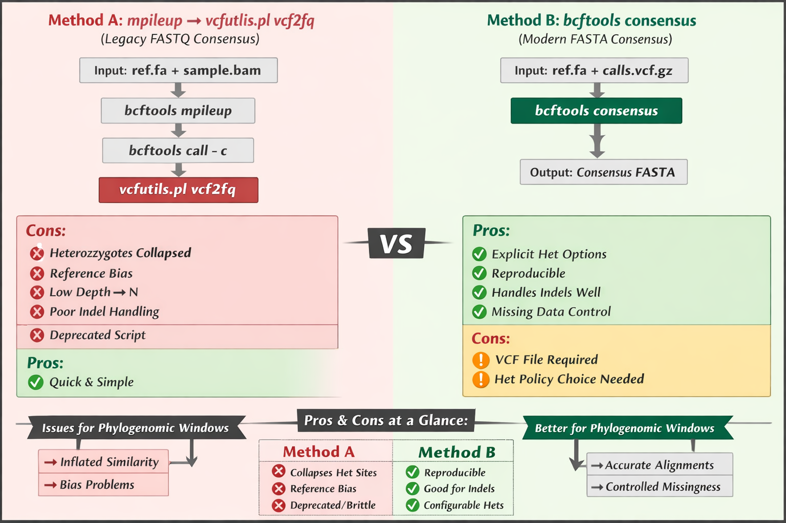

# Consensus Methods Note: Legacy vs Modern Approaches

This document explains why this project uses a modern, VCF-driven consensus
workflow (`bcftools consensus`) rather than legacy FASTQ consensus generation
(`vcfutils.pl vcf2fq`).

---

## Comparison Figure

  

---

## Legacy approach: `mpileup → vcfutils.pl vcf2fq`

**Summary**
- Generates a consensus FASTQ directly from BAM + reference
- Typically collapses heterozygous sites implicitly
- Often masks low-depth sites aggressively

**Limitations (relevant to phylogenomic windows)**
- Collapses heterozygous sites without explicit policy control
- Can introduce reference bias
- Poor / brittle handling of indels in many workflows
- Depends on deprecated or brittle scripts
- Can inflate similarity among samples, affecting window-based analyses

---

## Modern approach: `bcftools consensus`

**Summary**
- Separates variant calling from consensus generation
- Uses an explicit VCF as input plus the reference FASTA
- Allows explicit control of missing data and heterozygosity policies

**Advantages**
- Reproducible and transparent (VCF-driven)
- Better supported / maintained tooling
- Explicit policies for heterozygotes and missing data
- Robust handling of indels
- More appropriate for window-based FASTA extraction and downstream alignments

---

## Implications for this pipeline

Because this project relies on:
- SNP-defined genomic windows
- Window-based FASTA extraction across many samples
- Alignment-ready per-window FASTA outputs

the modern VCF-based consensus strategy improves interpretability and reduces
bias compared to legacy FASTQ-based approaches.

For these reasons, legacy `vcfutils.pl vcf2fq` workflows are not used in this
pipeline.
