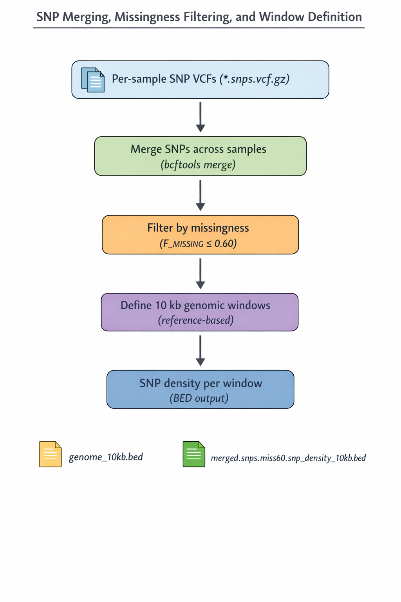

# Modern BAM → SNP Windows → Window-based FASTA Assemblies

This repository implements a SLURM-based pipeline for processing modern
resequencing data into **SNP-defined genomic windows** and **window-specific
multi-sample FASTA files** suitable for downstream alignment and phylogenetic
analyses.

The pipeline is designed to:
- Minimize reference bias
- Keep window definitions independent of downstream sequence filtering
- Maintain strict coordinate consistency across all samples

---

## Pipeline Overview

The pipeline is organized into four sequential steps:

1. **Per-sample SNP generation from BAM files**
2. **Multi-sample SNP merging and SNP density estimation**
3. **SNP-based window definition and FASTA extraction**
4. **Window-based FASTA assembly across samples**

Each step is implemented as an independent SLURM script.

---

## Step 01 — Per-sample SNP Generation

### Script
- `01.modern_bam_to_fasta_majority.sbatch`

### Description

This step processes mapped BAM files independently for each sample to generate
SNP VCFs using a majority-rule calling strategy.

Variant calling is performed using `bcftools mpileup` and
`bcftools call -c`, relying exclusively on observed read data and explicit
quality thresholds.

The output of this step consists of **per-sample SNP VCF files**, which serve as
input for downstream multi-sample aggregation.

### Workflow diagram

  

---

## Step 02 — SNP Merging and Window Definition (SNP Density)

### Script
- `merge_snps_miss60_density.sbatch`

### Purpose

This step aggregates SNPs across all samples and defines a
**reference-based genomic windowing framework**.

Specifically, it is used to:

- Merge per-sample SNP VCFs into a multi-sample VCF
- Filter SNP sites by overall missingness
- Define fixed genomic windows based on reference coordinates
- Quantify SNP density per window

This step is **not intended** to produce a final genotype dataset for inference.

---

### Processing summary

1. Merge per-sample SNP VCFs using `bcftools merge`
2. Filter SNPs by site-level missingness
3. Retain SNPs only (indels excluded)
4. Define fixed genomic windows based on the reference genome
5. Count SNPs per window to estimate genome-wide SNP density

---

### Treatment of multiallelic sites

Multiallelic SNPs are intentionally retained at this stage.

At this point, SNPs are treated strictly as **positional markers** used to
define genomic windows and assess polymorphism density.
Multiallelic filtering can be applied later without affecting window
definitions.

### Workflow diagram

  

---

## Step 03 — SNP-based Window Definition and FASTA Extraction

### Script
- `03.GetAlign_make_bed_windows_and_fastas.sbatch`

### Purpose

This step converts SNP information from the merged VCF into
**reference-coordinate BED windows** and applies those windows uniformly to
per-sample FASTA files.

The reference genome FASTA is used to:
- Validate chromosome boundaries
- Ensure all window coordinates are valid with respect to chromosome lengths

---

### Inputs

This step requires:

1. A **merged multi-sample SNP VCF**
2. A **reference genome FASTA**
3. **Per-sample FASTA files**

All window definitions are shared across samples and are independent of
sample-specific sequence content.

---

### Processing overview

1. Define genomic windows based on a fixed number of consecutive SNPs
   (e.g. 50 SNPs per window), resetting at chromosome boundaries
2. Validate window coordinates against reference chromosome lengths
3. Generate a BED file describing all SNP-based windows
4. Apply the BED windows uniformly to each per-sample FASTA file

This produces per-sample FASTA files in which each sequence corresponds to a
single SNP-defined genomic window expressed in reference coordinates.

---

### Conceptual note

Although window boundaries are derived from SNP positions, all windows are
expressed in reference genome coordinates. This ensures that:

- Window definitions are independent of FASTA content
- FASTA extraction is purely coordinate-based
- No circularity is introduced between SNP selection and sequence analysis

---

## Step 04 — Window-based FASTA Assembly

### Script
- `04.windows_to_alignments.sbatch`

### Purpose

This step assembles **window-specific multi-sample FASTA files** by merging
windowed FASTA sequences across samples.

Each output file corresponds to a single genomic window and contains sequences
from all samples.

---

### Processing logic

1. Extract window-specific sequences for each sample
2. Store sequences temporarily on a per-sample basis
3. Merge sequences across samples for each genomic window
4. Generate one FASTA file per window with consistent naming

---

### Outputs

