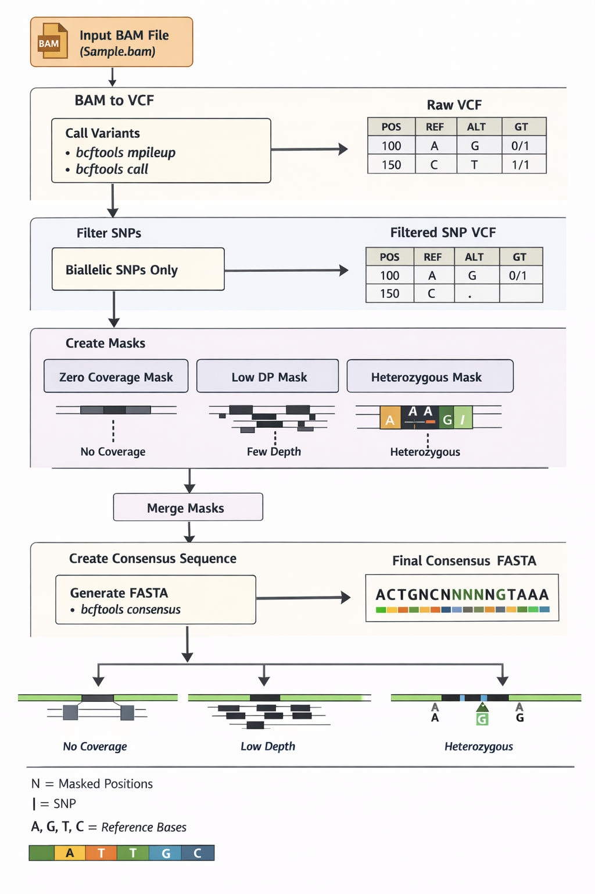

# Modern BAM → Majority-rule Consensus FASTA

This repository contains a SLURM-based pipeline to process **modern resequencing BAM files**
and generate **majority-rule variant calls** as an intermediate step toward
**sample-specific consensus FASTA sequences**.

The workflow is designed to minimize reference bias by relying on observed
read data and explicit quality thresholds.

---

## Script

- `01.modern_bam_to_fasta_majority.sbatch`  
  SLURM batch script to generate majority-rule VCFs from BAM files using `bcftools`.

---

## Workflow Overview

  

  <strong>Figure 1.</strong> Workflow used to convert mapped BAM files into
  sample-specific majority-rule consensus sequences.
  BAM files are summarized into VCFs using <code>bcftools mpileup</code> and
  <code>bcftools call -c</code>, followed by filtering, masking of low-confidence
  sites, and consensus sequence generation.

---

## Input Files

### Required inputs

- **BAM list file**

